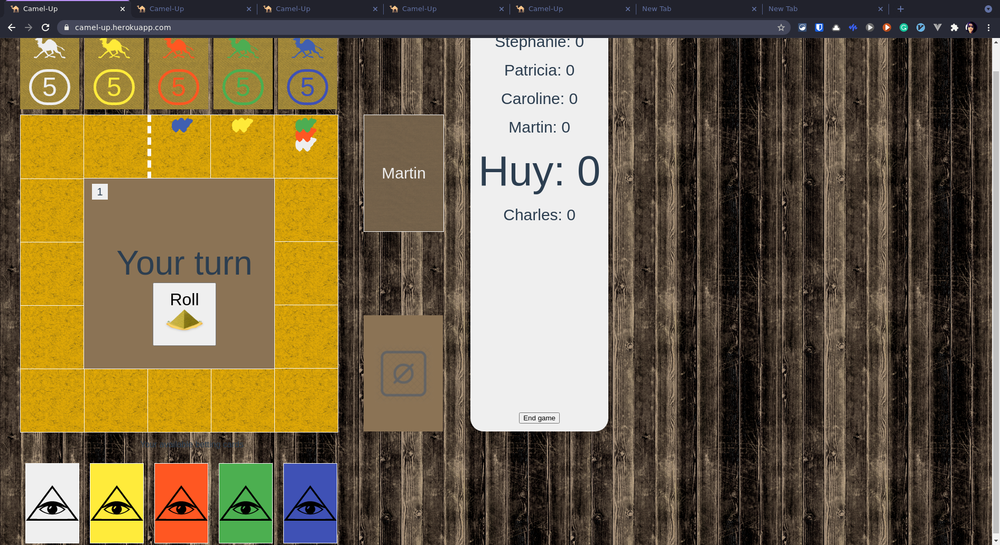

# Camel Up multi-player game

Written with Python/Flask as Backend and Vue v3 as Frontend.

[Demo](https://camel-up.herokuapp.com/)

The game rule can be found [here](https://www.ultraboardgames.com/camel-up/game-rules.php)
